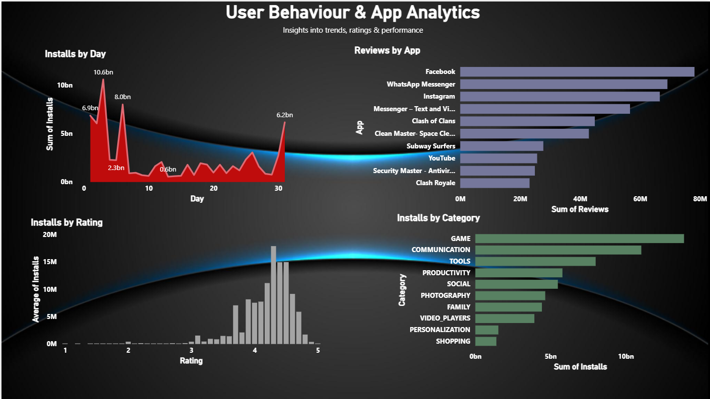

# 📊 Mobile App Analytics Dashboard

## 🚀 Overview

This project is a Power BI dashboard built using Android app data to analyze app performance, user behavior, and trends.

---

## 📌 Key Insights

* 📈 App installs trend over time
* ⭐ Relationship between ratings and installs
* 🏆 Top performing apps based on user reviews
* 📊 Category-wise install distribution

---

## 🛠️ Tools Used

* Power BI
* DAX
* Power Query

---

## 📂 Dataset

* Google Play Store dataset
* User reviews dataset

---

## 📷 Dashboard Preview

---

## 💡 Learnings

* Data cleaning and transformation
* Handling skewed datasets
* Choosing appropriate visualizations
* Building interactive dashboards

---

## 🔗 Project Files

* Dashboard: `.pbix` file
* Dataset: CSV files included

---

## 🙌 Author

Piyush Negi
.
